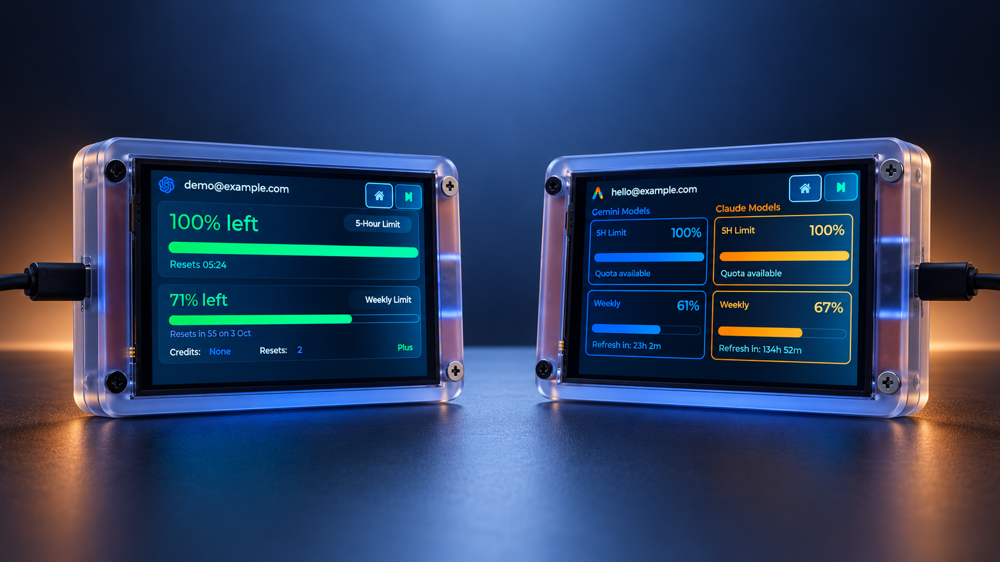
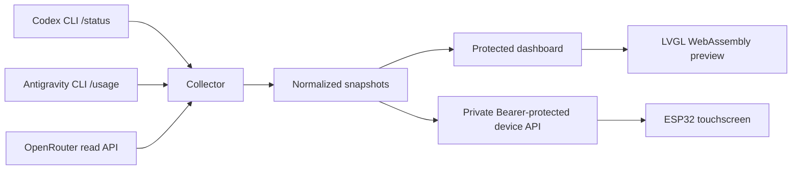

<div align="center">


# CYD Usage Monitor

**Your AI quotas, at a glance. On your desk and in your browser.**

A self-hosted dashboard and ESP32 touchscreen for Codex, Antigravity, and OpenRouter.

[](https://github.com/shaiadams10/cyd-usage-monitor/actions/workflows/ci.yml)
[](LICENSE)
[](cyd-usage-monitor/src/main.cpp)
[](cyd-usage-monitor/docker-compose.yml)

[Get started](#quick-start) · [Operator guide](cyd-usage-monitor/README.md) · [Hardware](cyd-usage-monitor/README.md#hardware--pin-mapping) · [Changelog](cyd-usage-monitor/CHANGELOG.md)

</div>



*Illustrative device artwork with example accounts and quota values.*

## Why build this?

Checking several AI accounts means opening several apps and hunting for quota panels. CYD Usage Monitor collects those readings in one place and puts the account you care about on a small touchscreen beside your keyboard.

Use the browser dashboard on its own, or add the physical display. Both consume the same snapshots; the browser preview runs the device's LVGL interface through WebAssembly.

## What you get

- **One view across accounts.** Manage isolated CLI profiles and choose which account appears on the display.
- **Quota that is clear.** Remaining five-hour and weekly allowances, reset times, and explicit exhaustion warnings.
- **Codex credits and banked resets.** White headings with blue value badges. Reset counts are read-only; collecting or viewing them never spends a reset.
- **OpenRouter telemetry.** Account credits, spend, and activity through its documented management API.
- **A matching browser preview.** Shared LVGL artwork, animations, and layouts rather than a separate approximation.
- **Fast account selection.** Touch controls, dashboard selection, Stream Deck buttons, and optional Windows desktop message hooks.
- **Freshness you can inspect.** Independently confirmed Codex reads, validation of missing data, and clearly labeled last-confirmed readings during retries.
- **Optional outage alerts.** WhatsApp via WAHA and TLS SMTP email fallback, with delivery health and incident history.

### Provider coverage

| Provider | Collected data | Source |
| --- | --- | --- |
| OpenAI Codex | Five-hour and weekly quota, reset times, credits, available reset count when reported | Authenticated CLI `/status` and its visible startup notice |
| Google Antigravity | Gemini and Claude five-hour and weekly quota, reset status | Authenticated CLI `/usage` |
| OpenRouter | Account-wide credits, spend, activity | Documented management API read endpoints |

CLI layouts are version-dependent. An absent reset notice displays **Not reported**. Missing or unconfirmed quota data never becomes a synthetic full allowance.

## How it works



Quota collection stays inside authenticated CLI profiles. It does not import provider credentials or call private quota APIs. The optional Codex desktop hook reads account identity through the local official app-server solely to select an already configured profile.

The selected CLI account refreshes every 30 seconds by default; other accounts every 90 seconds. These are scheduling intervals, not a guarantee that a provider panel will be ready immediately. The device polls normalized telemetry independently.

## Quick start

### 1. Start the monitor on a private Linux host

You need Docker Compose and the provider CLIs installed on that host for the CLI accounts you plan to monitor. Follow the [deployment runbook](cyd-usage-monitor/instructions/DEPLOYMENT_RUNBOOK.md) for host paths, authentication, and dashboard exposure.

```sh
git clone https://github.com/shaiadams10/cyd-usage-monitor.git
cd cyd-usage-monitor/cyd-usage-monitor
cp .env.example .env
# Edit .env with private passwords, tokens, host CLI paths, and LAN settings.
docker compose --env-file .env config --quiet
docker compose up -d --build
```

Use a unique dashboard password of at least 16 characters and a random device token of at least 24 characters. Configure a private data/profile directory, then add and sign in to accounts through the dashboard. Provider profiles and keys remain in private runtime storage.

Expose the dashboard only through an appropriate HTTPS proxy or Cloudflare Access/Tunnel configuration. Keep the separate device listener on the private LAN; do not publish it through the tunnel or forward it from the internet.

### 2. Add the physical display

The current firmware supports the **Hosyond/LCDWiki E32R40T 4.0-inch ESP32-32E**, with a **480×320 landscape ST7796S display** and **XPT2046 resistive touch**. The PlatformIO environment retains the historical name `esp32-2432S028R`; this name does not establish compatibility with other CYD boards.

From the project directory:

```sh
cp include/secrets.h.example include/secrets.h
# Set Wi-Fi, the private LAN telemetry URL, and the matching device token.
pio run -e esp32-2432S028R
pio device list
pio run -e esp32-2432S028R --target upload --upload-port <your-port>
```

The device uses a literal private RFC1918 IPv4 endpoint. See the [flashing guide](cyd-usage-monitor/instructions/FLASHING_GUIDE.md) and [pin mapping](cyd-usage-monitor/README.md#hardware--pin-mapping) before connecting or flashing hardware. Configured firmware contains secrets; never publish the binary.

### 3. Make it fit your workflow

Select an account in the dashboard or on the touchscreen. Add [Stream Deck controls](cyd-usage-monitor/README.md#stream-deck-account-cycling), or follow the [Windows desktop setup guide](cyd-usage-monitor/instructions/CHAT_ACCOUNT_SWITCH_SETUP.md) to select accounts when submitting messages.

## Documentation

| Guide | What it covers |
| --- | --- |
| [Operator guide](cyd-usage-monitor/README.md) | Collection, dashboard, hardware, controls, alerts, and troubleshooting |
| [Deployment runbook](cyd-usage-monitor/instructions/DEPLOYMENT_RUNBOOK.md) | Private host setup and dashboard/device network boundaries |
| [Flashing guide](cyd-usage-monitor/instructions/FLASHING_GUIDE.md) | Device configuration, build, upload, and serial verification |
| [Authentication guide](cyd-usage-monitor/instructions/TOKEN_GUIDE.md) | CLI profiles, device tokens, and private credential handling |
| [Desktop integration](cyd-usage-monitor/instructions/CHAT_ACCOUNT_SWITCH_SETUP.md) | Fresh Windows setup, account mappings, startup, and recovery |
| [Changelog](cyd-usage-monitor/CHANGELOG.md) | Release history and behavior changes |

## Development

```sh
python -m unittest discover -s cyd-usage-monitor/server
python -m unittest discover -s cyd-usage-monitor/scripts -p "test_*.py"
cd cyd-usage-monitor
pio run
```

For simulator changes, use PowerShell with Emscripten 3.1.74:

```powershell
./simulator/build-wasm.ps1 -TestMotion
./simulator/build-wasm.ps1
```

CI checks server/API tests, Windows helpers, Compose configuration, container and firmware builds, and the LVGL/WASM tests and exports. Dependencies are pinned in the project build configuration. Read [CONTRIBUTING.md](CONTRIBUTING.md) and [AGENTS.md](AGENTS.md) before changing source.

```text
cyd-usage-monitor/
├── src/             ESP32 firmware and shared UI motion
├── include/         LVGL configuration and secrets template
├── server/          Collector, dashboard, API, tests, and web assets
├── simulator/       LVGL WebAssembly build and regression tests
├── scripts/         Optional Windows and Stream Deck integrations
└── instructions/    Deployment, authentication, and device guides
docs/                Project context and illustrative screenshot
```

## Security and support

Keep `.env`, firmware secrets, CLI profiles, runtime snapshots, logs, and private keys out of Git. Report vulnerabilities through the process in [SECURITY.md](SECURITY.md). For bugs, include the affected provider, interface, version, and a redacted reproduction; never attach raw account or credential data.

This repository publishes the CYD monitor and its supporting documentation. Other local ESP32 projects are maintained separately from the current published tree.

## License

[MIT](LICENSE). An independent, unofficial project; it is not endorsed by OpenAI, Google, OpenRouter, or the hardware vendors. See [NOTICE.md](NOTICE.md) for artwork and trademark details.
