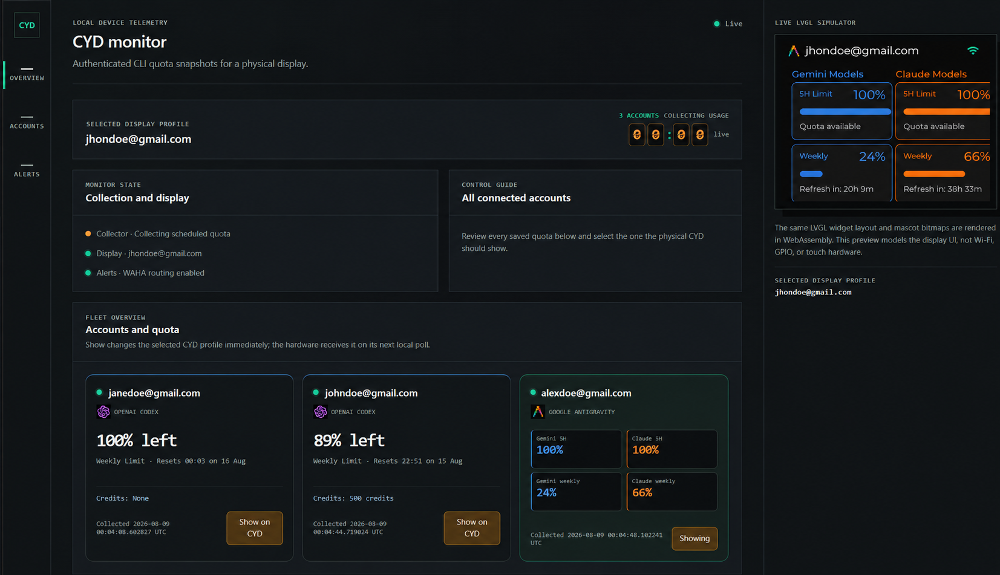

# CYD CLI Usage Monitor

An ESP32 Cheap Yellow Display (ESP32-2432S028R) that displays usage snapshots
from locally authenticated OpenAI Codex and Google Antigravity CLIs plus
account-wide OpenRouter credits and spend. A small Docker-hosted dashboard
manages isolated CLI profiles, private OpenRouter setup, and the CYD API.



## How it works

```text
Codex /status + Antigravity /usage + OpenRouter documented read APIs
                            |
       collector (isolated CLI profiles + private management key)
                 |
       normalized telemetry snapshot
           |                         |
 private-LAN CYD API          Access-protected dashboard
 (Bearer token, HTTP)          (Cloudflare Tunnel, HTTPS)
           |
 ESP32-2432S028R / Wokwi
```

The collector reads only the Codex and Antigravity CLIs' visible quota panels.
It does not copy browser cookies, `auth.json`, refresh tokens, or provider
credentials, and it does not call private provider HTTP APIs. OpenRouter is a
narrow exception using only its documented credits, key-list, and activity
read endpoints.

## Hardware

| Peripheral | Pins |
| --- | --- |
| ILI9341 display | MOSI 13, MISO 12, SCK 14, CS 15, DC 2, backlight 21 |
| XPT2046 touch | CS 33, IRQ 36, MOSI 32, MISO 39, CLK 25 |
| RGB LED | red 4, green 16, blue 17 |

## Security model

- The dashboard uses HTTP Basic authentication. Set a long, unique
  `MONITOR_ADMIN_PASSWORD`; if it is absent, the service generates a password
  on first start and stores it only in the private data directory.
- `CYD_API_TOKEN` is required. The firmware and server must use the same
  value and it must contain at least 24 characters; requests without it
  receive `401 Unauthorized`.
- Only the browser dashboard is public through Cloudflare Tunnel and an
  identity-based Access policy. The CYD API uses a separate server listener
  published only on the monitor host's private LAN address.
- Dashboard writes require JSON plus a browser-only verification header. The
  physical CYD endpoint remains Bearer-only, while the browser preview uses a
  separate Basic-authenticated endpoint.
- Provider authorization input is consumed from a private one-time inbox. It
  is never included in dashboard status responses, and temporary login URLs,
  device codes, and transcripts are scrubbed when a workflow ends.
- Never forward the LAN device port through a router, reverse proxy, or
  Tunnel. Firmware rejects non-RFC1918 endpoint addresses before attaching
  its Bearer token.
- Keep the Compose data directory and CLI profile directory private. They may
  contain dashboard state, CLI credentials, the OpenRouter Management API key,
  and account usage data.
- OpenRouter setup accepts its Management API key only through the protected
  dashboard. The mode-`0600` runtime secret is never returned to the browser,
  firmware, device API, logs, or CLI subprocesses; removing OpenRouter deletes
  both the key and its normalized snapshot.
- Optional WAHA alert credentials remain only in `.env`; the dashboard never
  returns the API key, and provider CLI child processes do not inherit it.
- Removing an account queues deletion of its complete isolated CLI credential
  directory in addition to removing monitor telemetry.

## Setup

### 1. Configure the server

Install Docker Compose, the Codex CLI, and the Antigravity CLI on a private
Linux host. Clone this repository, then copy the example configuration:

```sh
cd cyd-usage-monitor
cp .env.example .env
```

Set all of the following in the private `.env` file:

- `MONITOR_ADMIN_PASSWORD` — a unique password of at least 16 characters.
- `CYD_API_TOKEN` — a random shared device token of at least 24 characters.
- `CYD_LAN_BIND_ADDRESS` — the monitor host's private LAN IPv4 address.
- `CYD_LAN_PORT` — the host port for the LAN-only device API (default 8001).
- `AGY_HOST_PATH`, `CODEX_HOST_DIR`, and `NODE_BIN_HOST_DIR` — absolute paths
  to the host-installed CLI executable/installations.
- Optional WAHA settings if WhatsApp alerts are required.

`CYD_MONITOR_HOST_DATA_DIR` and `CYD_MONITOR_HOST_PROFILE_DIR` default to
ignored `./data` and `./profiles` directories. Assign a non-root
`CYD_MONITOR_UID` and `CYD_MONITOR_GID` if Docker must write files as a
specific host user.

### 2. Configure the Cloudflare Tunnel

The Compose stack includes a pinned, remotely managed `cloudflared` connector.
The dashboard listener is reachable only from `cloudflared` on the private
`monitor-ingress` Docker network. A second, route-isolated device listener is
published only on `CYD_LAN_BIND_ADDRESS`; the collector retains host
networking for its operator-configured local CLI and WAHA integrations.

Run this Compose stack only on the operator-selected origin host. Record that
host and deployment directory in the ignored `.env`; development workstations
must not retain or run the Tunnel token.

See [`instructions/DEPLOYMENT_RUNBOOK.md`](instructions/DEPLOYMENT_RUNBOOK.md)
for the complete login, credential placement, deployment, verification,
rollback, and public-release procedure.

Create only `CLOUDFLARE_DASHBOARD_HOSTNAME`. Use a remotely managed Tunnel
with the dashboard hostname routed to `http://cyd-monitor-app:8000`, followed
by a final `http_status:404` catch-all. Do not create a public device route.

Protect the dashboard hostname with a self-hosted Cloudflare Access
application and an Allow policy containing only the operator's identity.
The dashboard listener deliberately returns `404` for device API paths. The
private listener deliberately returns `404` for dashboard and admin paths.

For one-time API provisioning, create a narrowly scoped Cloudflare API token:

- Account / **Cloudflare Tunnel / Edit** for the selected account.
- Account / **Access: Apps and Policies / Edit** for the selected account.
- Zone / **DNS / Edit** for only the intended DNS zone.
- Zone / **Zone / Read** for only that zone, if the provisioning tool must
  discover its zone ID instead of using `CLOUDFLARE_ZONE_ID`.

Put this management token in the ignored `.env` only while provisioning. It
is not passed to any container and can be revoked afterward. The separate
`CLOUDFLARE_TUNNEL_TOKEN` is consumed only by `cloudflared` on the origin host.

### 3. Start the server and Tunnel

After the remote Tunnel, DNS records, ingress rules, and Access applications
exist, set `CLOUDFLARE_TUNNEL_TOKEN` and start the services:

```sh
docker compose up -d --build
docker compose ps
```

The Compose services run read-only, drop Linux capabilities, enable
`no-new-privileges`, and use bounded PID and temporary-filesystem resources.
Port 8000 is not published by Compose. Port 8001 is bound only to the private
address configured in ignored `.env`. Visit the Access-protected dashboard
hostname, pass the Cloudflare identity check, then sign in as `admin`, create
an account profile, and complete the CLI login flow. The collector stores each
CLI profile in its isolated private directory and polls usage every 90 seconds
by default. To enable OpenRouter, use **Accounts / OpenRouter account** to save
a dedicated Management API key and display label. Saving queues an immediate
collection; the monitor never creates, edits, or deletes OpenRouter keys.

### 4. Configure the CYD firmware

Copy `include/secrets.h.example` to the ignored `include/secrets.h`. Set
`TELEMETRY_SERVER_URL` to the monitor's private RFC1918 IPv4 address and LAN
port, ending in `/api/v1/cyd-status`, and set `TELEMETRY_API_TOKEN` to the same
value as `CYD_API_TOKEN`. Firmware refuses HTTPS, public IP addresses, and
hostnames so it cannot accidentally send the reusable token over the public
Internet. Keep the LAN trusted and do not configure router port forwarding.
The ESP32 holds only the monitor endpoint and its device token—not provider
credentials.

Build and upload with PlatformIO:

```sh
pio run -e esp32-2432S028R
pio run -e esp32-2432S028R --target upload
```

For port discovery, first-device setup, safe verification, troubleshooting,
and credential-loss response, follow
[`instructions/FLASHING_GUIDE.md`](instructions/FLASHING_GUIDE.md). The
protected dashboard also includes a **Utilities** tab with the same quick
workflow, a Wokwi keyboard-shortcut cheat sheet, and a link to the canonical
guide.

The build uses Espressif's standard `min_spiffs` partition table. This retains
two OTA-capable application slots while giving the LVGL firmware substantially
more room than the default layout; the monitor does not use SPIFFS.

On every boot the CYD now opens a pastel **CYD Apps** launcher instead of
entering telemetry directly. Wi-Fi connects in the background while the menu
remains responsive. Tap **Usage Monitor** for the selected Codex/Antigravity
account or **OpenRouter** for the independent credits-and-spend screen, then use
the Home button in either header to return to the launcher. The OpenRouter app
shows remaining credits, today/week/month spend, seven completed UTC days, and
the top model for that seven-day window. Each app polls cached LAN telemetry
every three seconds only while visible; upstream collection remains on the
90-second host schedule.

### 5. Optional local UI preview

The dashboard includes an interactive LVGL WebAssembly preview built from the
shared CYD visual assets and launcher behavior. Click or tap either launcher
tile and use the simulated Home button. Usage Monitor's Next control selects
the following saved CLI profile in the dashboard as well as updating the
preview. Its preview stays in the
right-hand dashboard rail at normal desktop widths and scales the logical
320×240 display to 340×255 for easier inspection. The WebAssembly-only
Antigravity grid uses additional edge gutters so all four cards remain fully
visible without changing the physical CYD layout. Rebuild it after changing
`simulator/lvgl_cyd_sim.c`:

```powershell
.\simulator\build-wasm.ps1
```

The simulator build requires Emscripten 3.1.74. Set `EMSDK_ROOT` when emsdk is
not installed under the default per-user `.tools/emsdk` directory.

`diagram.json` and `wokwi.toml` support optional Wokwi firmware simulation.
Wokwi's private IoT gateway can reach the monitor server on the local network.
It uses the same fast LAN-only firmware target as the physical CYD.

Build the binary referenced by `wokwi.toml`:

```powershell
pio run -e esp32-2432S028R
```

Restart Wokwi after every rebuild. The server and firmware reuse the local
HTTP/1.1 connection across three-second status polls. The account-change endpoint
returns the new telemetry in its response, avoiding a second request. Focus the
Wokwi Serial Monitor and use these semantic touch shortcuts:

- `U` opens Usage Monitor from the launcher.
- `O` opens OpenRouter from the launcher.
- `H` returns to the launcher.
- `N` switches to the next account while Usage Monitor is open.
- `?` prints the shortcut cheat sheet in the Serial Monitor.

The legacy space shortcut still switches accounts for compatibility. The same
cheat sheet is available in the protected dashboard's **Utilities** tab. The
first fetch occurs when Usage Monitor opens or as soon as the background Wi-Fi
connection becomes ready. A `[NET]` diagnostic indicates a wrong LAN address,
unreachable server, or closed port.

## Optional WAHA alerts

The collector can send one WhatsApp alert when a profile has failed for three
consecutive collection cycles and one recovery message after the next
successful collection. Fewer than three incomplete CLI captures remain in the
protected incident history but recover silently, avoiding false failure and
recovery pairs for transient provider screens. Set
`CYD_MONITOR_ALERT_FAILURE_THRESHOLD` to change the confirmation count (1–10),
and set `WAHA_URL`,
`WAHA_API_KEY`, `WAHA_SESSION`, and `WAHA_ALERT_CHAT_ID` in the private `.env`
file. The dashboard stores only the group routing ID; it never exposes the
WAHA API key. Set `CYD_MONITOR_TIMEZONE` to an IANA timezone such as
`America/New_York` if alert timestamps should use local time; it defaults to
UTC.

Failure alerts use WhatsApp formatting and include the first detection time,
the number of consecutive failed collections,
observed parser/CLI symptom, privacy-safe capture counts, a diagnostic ID, the
poll interval, and the exact automatic action that will occur. Recovery alerts
report the interruption duration and distinguish a later successful poll from
an actual reconnect or credential change.

The protected dashboard's **Alerts** view retains the latest 50 structured
incidents, including repeated failed-poll counts and recovery details. For
deeper debugging, the collector keeps at most 50 redacted terminal captures as
mode-`0600` JSON files under the private runtime data directory's
`.collector-debug/` folder. These host-only captures are not returned by an API
or sent to WhatsApp; use the alert's diagnostic ID to locate the matching file.
URLs, email addresses, and long opaque values are redacted before storage.

## Development checks

```sh
python -m unittest discover -s server -v
pio run -e esp32-2432S028R
```

For server changes, also start the stack with a private test configuration and
verify an authenticated dashboard request plus a CYD API request with a valid
Bearer token.

## Repository hygiene

Tracked source and configuration contain no real credentials, personal
endpoints, routing IDs, or operator account data. The promotional screenshot
uses illustrative account labels. Do not commit `.env`, `include/secrets.h`, `data/`,
`profiles/`, generated build output, or private keys. See `AGENTS.md` and
`instructions/TOKEN_GUIDE.md` for the project maintenance and authentication
rules.

Pinned PlatformIO, library, Docker, and Emscripten versions make local and CI
builds repeatable. The production server image is pinned to
`python:3.14.0-slim-bookworm`. GitHub CI runs server/API tests, Compose and
Docker checks, the firmware build, and a clean WebAssembly regeneration with
JavaScript syntax and semantic module-export ABI smoke checks. The ABI check
uses the generated Emscripten wrapper rather than optimization-dependent raw
WASM export names.
Tests keep all runtime state in temporary directories so clean Linux and
Windows runners do not depend on host paths or permissions. Simulator sources
are sorted and path-normalized before compilation; generated binaries can still
differ between operating-system toolchain environments while remaining
functionally equivalent.

Provider names belong to their respective owners. The tiny RGB565 pictures are
unofficial project-created compatibility artwork; see the repository
[`NOTICE.md`](../NOTICE.md) for the non-endorsement and trademark notice.

## License

This project is released under the repository's
[MIT License](../LICENSE).
